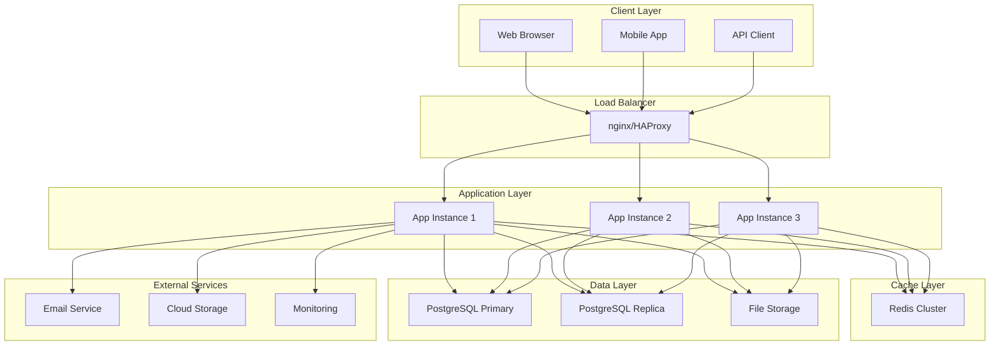
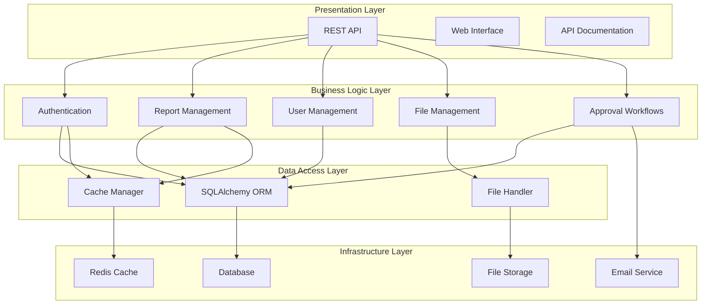
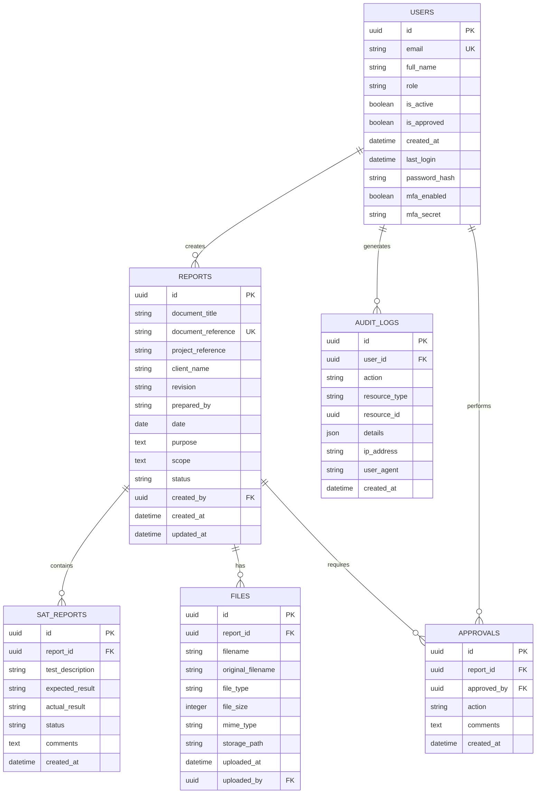
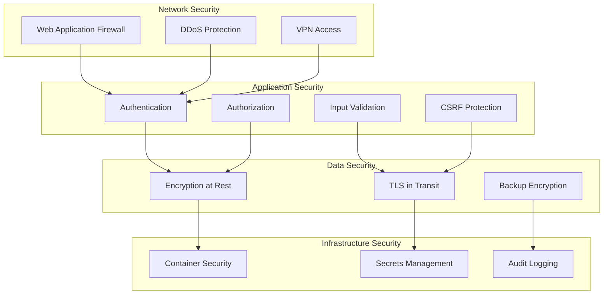
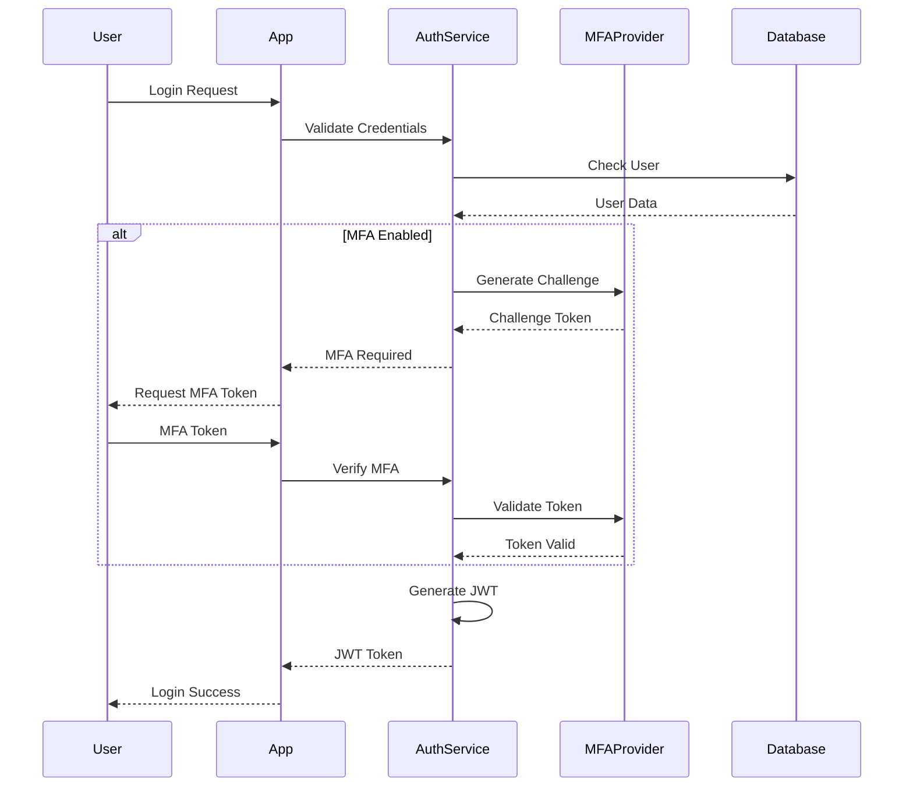
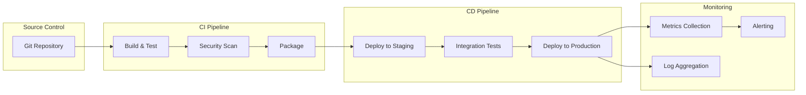
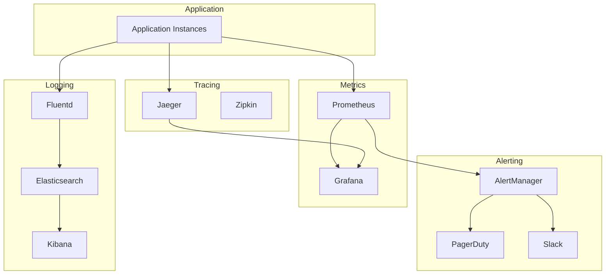

# SAT Report Generator - Architecture Documentation

## Overview

The SAT Report Generator is an enterprise-grade web application built using modern software architecture principles. This document provides a comprehensive overview of the system architecture, design patterns, and technical decisions that enable scalability, maintainability, and security.

## Table of Contents

1. [System Architecture](#system-architecture)
2. [Application Architecture](#application-architecture)
3. [Data Architecture](#data-architecture)
4. [Security Architecture](#security-architecture)
5. [Infrastructure Architecture](#infrastructure-architecture)
6. [Integration Architecture](#integration-architecture)
7. [Deployment Architecture](#deployment-architecture)
8. [Monitoring Architecture](#monitoring-architecture)
9. [Design Patterns](#design-patterns)
10. [Technology Stack](#technology-stack)

## System Architecture

### High-Level Architecture



### Architecture Principles

**1. Scalability**
- Horizontal scaling through stateless application design
- Database read replicas for read-heavy workloads
- Caching layer to reduce database load
- Microservices-ready architecture

**2. Reliability**
- High availability through redundancy
- Graceful degradation of non-critical features
- Circuit breaker pattern for external dependencies
- Comprehensive error handling and recovery

**3. Security**
- Defense in depth security model
- Zero-trust network architecture
- Encryption at rest and in transit
- Role-based access control (RBAC)

**4. Maintainability**
- Clean architecture with separation of concerns
- Comprehensive testing strategy
- Automated deployment pipelines
- Extensive monitoring and observability

## Application Architecture

### Layered Architecture



### Component Architecture

**Core Components:**

1. **API Gateway**
   - Request routing and load balancing
   - Authentication and authorization
   - Rate limiting and throttling
   - Request/response transformation

2. **Authentication Service**
   - User authentication (JWT, OAuth2, SAML)
   - Multi-factor authentication (MFA)
   - Session management
   - Password policies

3. **Report Management Service**
   - Report CRUD operations
   - Document generation
   - Version control
   - Template management

4. **Workflow Engine**
   - Approval workflows
   - State machine implementation
   - Notification system
   - Audit trail

5. **File Management Service**
   - File upload/download
   - Storage abstraction
   - Virus scanning
   - Metadata extraction

### Design Patterns

**1. Repository Pattern**
```python
class ReportRepository:
    def __init__(self, db_session):
        self.db = db_session
    
    def find_by_id(self, report_id):
        return self.db.query(Report).filter(Report.id == report_id).first()
    
    def find_by_status(self, status):
        return self.db.query(Report).filter(Report.status == status).all()
    
    def save(self, report):
        self.db.add(report)
        self.db.commit()
        return report
```

**2. Factory Pattern**
```python
class ReportFactory:
    @staticmethod
    def create_report(report_type, data):
        if report_type == 'SAT':
            return SATReport(**data)
        elif report_type == 'FAT':
            return FATReport(**data)
        else:
            raise ValueError(f"Unknown report type: {report_type}")
```

**3. Observer Pattern**
```python
class ReportEventManager:
    def __init__(self):
        self.observers = []
    
    def subscribe(self, observer):
        self.observers.append(observer)
    
    def notify(self, event, data):
        for observer in self.observers:
            observer.handle_event(event, data)
```

**4. Strategy Pattern**
```python
class DocumentGenerator:
    def __init__(self, strategy):
        self.strategy = strategy
    
    def generate(self, report):
        return self.strategy.generate_document(report)

class PDFGenerationStrategy:
    def generate_document(self, report):
        # PDF generation logic
        pass

class WordGenerationStrategy:
    def generate_document(self, report):
        # Word document generation logic
        pass
```

## Data Architecture

### Database Design

**Entity Relationship Diagram:**



### Data Access Patterns

**1. Active Record Pattern**
```python
class Report(db.Model):
    __tablename__ = 'reports'
    
    id = db.Column(db.String(36), primary_key=True, default=lambda: str(uuid.uuid4()))
    document_title = db.Column(db.String(200), nullable=False)
    status = db.Column(db.String(50), default='Draft')
    
    def submit_for_approval(self):
        self.status = 'Pending Approval'
        self.submitted_at = datetime.utcnow()
        db.session.commit()
    
    def approve(self, approved_by, comments=None):
        self.status = 'Approved'
        self.approved_by = approved_by
        self.approval_comments = comments
        db.session.commit()
```

**2. Data Transfer Objects (DTOs)**
```python
@dataclass
class ReportDTO:
    id: str
    document_title: str
    status: str
    created_at: datetime
    
    @classmethod
    def from_model(cls, report):
        return cls(
            id=report.id,
            document_title=report.document_title,
            status=report.status,
            created_at=report.created_at
        )
```

### Caching Strategy

**Multi-Level Caching:**

1. **Application Cache (L1)**
   - In-memory caching for frequently accessed data
   - Short TTL (5-15 minutes)
   - User sessions and permissions

2. **Distributed Cache (L2)**
   - Redis for shared cache across instances
   - Medium TTL (30 minutes - 2 hours)
   - Database query results, API responses

3. **CDN Cache (L3)**
   - Static assets and public content
   - Long TTL (24 hours - 7 days)
   - Images, CSS, JavaScript files

**Cache Patterns:**
```python
# Cache-aside pattern
def get_report(report_id):
    # Try cache first
    cached_report = cache.get(f"report:{report_id}")
    if cached_report:
        return cached_report
    
    # Fetch from database
    report = Report.query.get(report_id)
    if report:
        # Store in cache
        cache.set(f"report:{report_id}", report, timeout=1800)
    
    return report

# Write-through pattern
def update_report(report_id, data):
    report = Report.query.get(report_id)
    for key, value in data.items():
        setattr(report, key, value)
    
    db.session.commit()
    
    # Update cache
    cache.set(f"report:{report_id}", report, timeout=1800)
    
    return report
```

## Security Architecture

### Security Layers



### Authentication Architecture

**Multi-Factor Authentication Flow:**



### Authorization Model

**Role-Based Access Control (RBAC):**

```python
class Permission:
    # Report permissions
    REPORTS_READ = "reports:read"
    REPORTS_CREATE = "reports:create"
    REPORTS_UPDATE = "reports:update"
    REPORTS_DELETE = "reports:delete"
    REPORTS_APPROVE = "reports:approve"
    
    # User permissions
    USERS_READ = "users:read"
    USERS_CREATE = "users:create"
    USERS_UPDATE = "users:update"
    USERS_DELETE = "users:delete"
    
    # Admin permissions
    ADMIN_ACCESS = "admin:access"
    SYSTEM_CONFIG = "system:config"

ROLE_PERMISSIONS = {
    'Engineer': [
        Permission.REPORTS_READ,
        Permission.REPORTS_CREATE,
        Permission.REPORTS_UPDATE,
    ],
    'PM': [
        Permission.REPORTS_READ,
        Permission.REPORTS_APPROVE,
        Permission.USERS_READ,
    ],
    'Admin': [
        Permission.REPORTS_READ,
        Permission.REPORTS_CREATE,
        Permission.REPORTS_UPDATE,
        Permission.REPORTS_DELETE,
        Permission.REPORTS_APPROVE,
        Permission.USERS_READ,
        Permission.USERS_CREATE,
        Permission.USERS_UPDATE,
        Permission.USERS_DELETE,
        Permission.ADMIN_ACCESS,
        Permission.SYSTEM_CONFIG,
    ],
}
```

## Infrastructure Architecture

### Container Architecture

**Docker Multi-Stage Build:**

```dockerfile
# Build stage
FROM python:3.11-slim as builder

WORKDIR /app
COPY requirements.txt .
RUN pip install --no-cache-dir --user -r requirements.txt

# Production stage
FROM python:3.11-slim

# Create non-root user
RUN groupadd -r appuser && useradd -r -g appuser appuser

# Copy dependencies
COPY --from=builder /root/.local /home/appuser/.local

# Copy application
COPY --chown=appuser:appuser . /app
WORKDIR /app

# Switch to non-root user
USER appuser

# Health check
HEALTHCHECK --interval=30s --timeout=10s --start-period=5s --retries=3 \
    CMD curl -f http://localhost:5000/health || exit 1

EXPOSE 5000
CMD ["gunicorn", "--bind", "0.0.0.0:5000", "--workers", "4", "app:create_app()"]
```

### Kubernetes Architecture

**Deployment Strategy:**

```yaml
apiVersion: apps/v1
kind: Deployment
metadata:
  name: sat-report-generator
spec:
  replicas: 3
  strategy:
    type: RollingUpdate
    rollingUpdate:
      maxSurge: 1
      maxUnavailable: 0
  selector:
    matchLabels:
      app: sat-report-generator
  template:
    metadata:
      labels:
        app: sat-report-generator
    spec:
      containers:
      - name: app
        image: sat-report-generator:latest
        ports:
        - containerPort: 5000
        env:
        - name: DATABASE_URL
          valueFrom:
            secretKeyRef:
              name: app-secrets
              key: database-url
        resources:
          requests:
            memory: "512Mi"
            cpu: "500m"
          limits:
            memory: "1Gi"
            cpu: "1000m"
        livenessProbe:
          httpGet:
            path: /health
            port: 5000
          initialDelaySeconds: 30
          periodSeconds: 10
        readinessProbe:
          httpGet:
            path: /health
            port: 5000
          initialDelaySeconds: 5
          periodSeconds: 5
```

### Service Mesh Architecture

**Istio Integration:**

```yaml
apiVersion: networking.istio.io/v1alpha3
kind: VirtualService
metadata:
  name: sat-report-generator
spec:
  http:
  - match:
    - uri:
        prefix: /api/v1
    route:
    - destination:
        host: sat-report-generator
        port:
          number: 5000
    fault:
      delay:
        percentage:
          value: 0.1
        fixedDelay: 5s
    retries:
      attempts: 3
      perTryTimeout: 2s
```

## Integration Architecture

### API Integration Patterns

**1. RESTful API Design**
```python
# Resource-based URLs
GET    /api/v1/reports           # List reports
POST   /api/v1/reports           # Create report
GET    /api/v1/reports/{id}      # Get report
PUT    /api/v1/reports/{id}      # Update report
DELETE /api/v1/reports/{id}      # Delete report

# Sub-resource relationships
GET    /api/v1/reports/{id}/files     # List report files
POST   /api/v1/reports/{id}/files     # Upload file
GET    /api/v1/reports/{id}/approvals # List approvals
POST   /api/v1/reports/{id}/approve   # Approve report
```

**2. Event-Driven Architecture**
```python
class EventBus:
    def __init__(self):
        self.subscribers = defaultdict(list)
    
    def subscribe(self, event_type, handler):
        self.subscribers[event_type].append(handler)
    
    def publish(self, event_type, data):
        for handler in self.subscribers[event_type]:
            handler(data)

# Usage
event_bus = EventBus()

# Subscribe to events
event_bus.subscribe('report.created', send_notification)
event_bus.subscribe('report.approved', generate_document)

# Publish events
event_bus.publish('report.created', {'report_id': '123', 'user_id': '456'})
```

### External Service Integration

**Email Service Integration:**
```python
class EmailService:
    def __init__(self, provider='smtp'):
        if provider == 'smtp':
            self.client = SMTPEmailClient()
        elif provider == 'sendgrid':
            self.client = SendGridClient()
        elif provider == 'ses':
            self.client = SESClient()
    
    def send_notification(self, template, recipient, data):
        try:
            message = self.render_template(template, data)
            self.client.send(recipient, message)
        except Exception as e:
            logger.error(f"Failed to send email: {e}")
            # Fallback to queue for retry
            self.queue_for_retry(template, recipient, data)
```

**File Storage Integration:**
```python
class StorageService:
    def __init__(self, provider='local'):
        if provider == 'local':
            self.client = LocalStorageClient()
        elif provider == 's3':
            self.client = S3StorageClient()
        elif provider == 'azure':
            self.client = AzureBlobClient()
    
    def upload_file(self, file_data, filename):
        try:
            file_path = self.client.upload(file_data, filename)
            return file_path
        except Exception as e:
            logger.error(f"Failed to upload file: {e}")
            raise StorageException(f"Upload failed: {e}")
```

## Deployment Architecture

### CI/CD Pipeline Architecture



### Environment Architecture

**Environment Separation:**

1. **Development**
   - Local development environment
   - Feature branch deployments
   - Mock external services

2. **Staging**
   - Production-like environment
   - Integration testing
   - Performance testing

3. **Production**
   - High availability setup
   - Auto-scaling enabled
   - Full monitoring and alerting

**Environment Configuration:**
```yaml
# environments/production.yaml
environment: production
debug: false
database:
  pool_size: 20
  max_overflow: 30
cache:
  ttl: 3600
security:
  session_timeout: 1800
  max_login_attempts: 3
monitoring:
  enabled: true
  metrics_interval: 30
```

## Monitoring Architecture

### Observability Stack



### Metrics Architecture

**Application Metrics:**
```python
from prometheus_client import Counter, Histogram, Gauge

# Request metrics
REQUEST_COUNT = Counter('http_requests_total', 'Total HTTP requests', ['method', 'endpoint', 'status'])
REQUEST_DURATION = Histogram('http_request_duration_seconds', 'HTTP request duration')

# Business metrics
REPORTS_CREATED = Counter('reports_created_total', 'Total reports created')
REPORTS_APPROVED = Counter('reports_approved_total', 'Total reports approved')
ACTIVE_USERS = Gauge('active_users_total', 'Number of active users')

# Infrastructure metrics
DATABASE_CONNECTIONS = Gauge('database_connections_active', 'Active database connections')
CACHE_HIT_RATE = Gauge('cache_hit_rate', 'Cache hit rate percentage')
```

### Distributed Tracing

**OpenTelemetry Integration:**
```python
from opentelemetry import trace
from opentelemetry.exporter.jaeger.thrift import JaegerExporter
from opentelemetry.sdk.trace import TracerProvider
from opentelemetry.sdk.trace.export import BatchSpanProcessor

# Configure tracing
trace.set_tracer_provider(TracerProvider())
tracer = trace.get_tracer(__name__)

jaeger_exporter = JaegerExporter(
    agent_host_name="jaeger",
    agent_port=6831,
)

span_processor = BatchSpanProcessor(jaeger_exporter)
trace.get_tracer_provider().add_span_processor(span_processor)

# Usage in application
@tracer.start_as_current_span("create_report")
def create_report(data):
    with tracer.start_as_current_span("validate_data"):
        validate_report_data(data)
    
    with tracer.start_as_current_span("save_to_database"):
        report = Report(**data)
        db.session.add(report)
        db.session.commit()
    
    return report
```

## Technology Stack

### Backend Technologies

**Core Framework:**
- **Flask**: Web framework with extensions
- **SQLAlchemy**: ORM and database toolkit
- **Marshmallow**: Serialization/deserialization
- **Celery**: Asynchronous task processing
- **Redis**: Caching and session storage

**Security:**
- **Flask-Login**: User session management
- **PyJWT**: JSON Web Token implementation
- **bcrypt**: Password hashing
- **pyotp**: TOTP for MFA
- **cryptography**: Encryption utilities

**Testing:**
- **pytest**: Testing framework
- **pytest-flask**: Flask testing utilities
- **factory-boy**: Test data generation
- **coverage**: Code coverage analysis

### Infrastructure Technologies

**Containerization:**
- **Docker**: Container platform
- **Docker Compose**: Multi-container orchestration
- **Kubernetes**: Container orchestration
- **Helm**: Kubernetes package manager

**Monitoring:**
- **Prometheus**: Metrics collection
- **Grafana**: Visualization and dashboards
- **Jaeger**: Distributed tracing
- **ELK Stack**: Centralized logging

**CI/CD:**
- **GitHub Actions**: CI/CD pipeline
- **SonarQube**: Code quality analysis
- **Snyk**: Security vulnerability scanning
- **Terraform**: Infrastructure as code

### Database Technologies

**Primary Database:**
- **PostgreSQL**: Relational database
- **pg_stat_statements**: Query performance monitoring
- **pg_trgm**: Full-text search capabilities

**Caching:**
- **Redis**: In-memory data structure store
- **Redis Cluster**: High availability caching
- **Redis Sentinel**: Monitoring and failover

This architecture documentation provides a comprehensive overview of the SAT Report Generator's technical design, enabling developers and architects to understand the system's structure and make informed decisions about future enhancements.